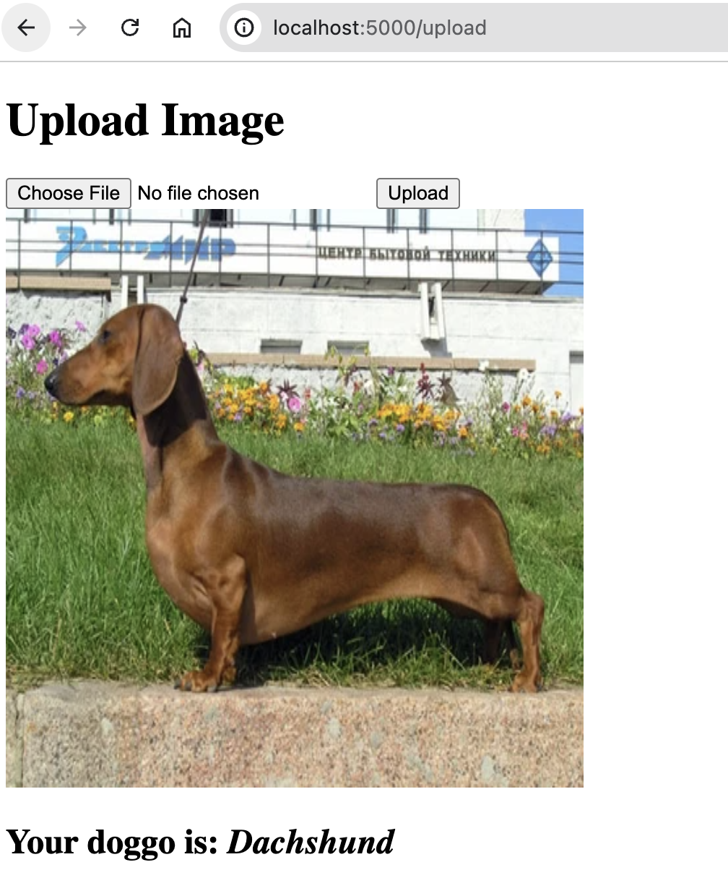

# mlops-project



## Problem Statement
This project aims to develop a Flask-based web application that allows users to upload images of dogs, which are then classified into specific breeds using a pre-trained machine learning model. The project will also focus on employing MLOps techniques to ensure the application is robust and maintainable. This includes continuous integration, continuous deployment (CI/CD), automated testing, and containerization.

http://ec2-54-91-116-13.compute-1.amazonaws.com

## Objective
The primary objective of this project is to create a web application that enables users to upload images of dogs and receive breed predictions. The project will cover the following key areas:
- Image Upload Functionality: Implement a web interface where users can upload images of dogs.
- Model Integration: Integrate a pre-trained machine learning model for dog breed classification.
- Image Storage: Ensure images are stored on the server.
- Prediction Retrieval: Provide a mechanism for users to view breed predictions.
- Code Quality: Utilize linting tools (e.g., flake8) to maintain high code quality.
- Automated Testing: Implement unit and integration tests using pytest to ensure the application works as expected.
- Continuous Integration: Set up GitHub Actions to automate testing and linting on each commit.
- Infrastructure as Code: AWS EC2 is created with the help of Terraform
- Containerization: Use Docker to containerize the application for consistent deployment across different environments.
- Makefile Automation: Create a Makefile to automate common tasks like building and running the Docker container, running tests, and linting.

## Infrastructure setup

### Generate EC2 instance SSH key
`cd iac && ssh-keygen -f dbc_key`

### Setup AWS
- Adjust terraform s3 backend name in the `providers.tf`
- Run `aws configure` and provide you Access Keys
- Adjust VPC ID in the `main.auto.tfvars`
- `terraform init`
- `terraform plan`
- `terraform apply`

### Configure Docker on the EC2
Substitute `<EC2_DNS_INSTANCE_HOSTNAME>` with the EC2 instance DNS address
```
ssh -i "dbc_key" ec2-user@<EC2_DNS_INSTANCE_HOSTNAME>
sudo yum install docker-ce docker-ce-cli containerd.io docker-buildx-plugin docker-compose-plugin
```

## Model training
Model `dog_breed_classifier_model.h5` is already commited to the repository but here are the steps to train it from scratch.
It needs MLFLOW instance running and AWS credentials to upload the artifact data to the MLFLOW's s3 bucket. This can be set in the `.env` file.

`make train-model`

GIT LFS is required to commit the model to the GitHub as it's more than 200MB.
```
git lfs install
git lfs track "*.h5"
git add .gitattributes
git add model/dog_breed_classifier_model.h5
```

## Webapp deployment
Webapp is deployed with GitHub Actions automatically to the EC2 instance automatically. GHA workflow requires the following secrets to be setup in order to sucessfully proceed with the deployment:

```
AWS_ACCESS_KEY_ID
AWS_SECRET_ACCESS_KEY
EC2_SSH_KEY
EC2_USER
EC2_HOST
```

Application should start listening at http://<EC2_DNS_NAME>:80
